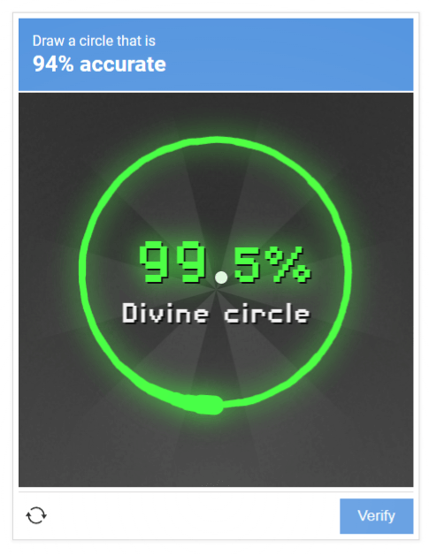

# MouseCircle

**MouseCircle** is a lightweight PowerShell tool that draws a perfect circle.
You choose the center point manually with your mouse, and the script handles the drawing motion automatically.

## What It Does

- Waits in the background after you launch it.
- You move your mouse to any point on the screen — this becomes the **center** of the circle.
- Press **F8**:
  - The script calculates a circular path around that center.
  - Moves the cursor to the first point of the circle.
  - **Holds the left mouse button down**.
  - Moves the cursor smoothly along a full circular path.
  - **Releases the left mouse button** at the end.
- Press **Esc** at any time to exit the script.

This is useful for:
- Drawing perfect circles in paint programs
- Automating repetitive circular motions
- Testing mouse input behavior
- And, most imporantly, beat [Not a Robot at neal.fun](https://neal.fun/not-a-robot/)



## Requirements

- Windows OS  
- PowerShell  
- Script execution enabled

If needed, enable script execution:

```powershell
Set-ExecutionPolicy -Scope CurrentUser RemoteSigned
```

## How to Use

1. Save the script as MouseCircle.ps1.
2. Open PowerShell in the folder where the script is saved.
3. Run:
```powershell
.\MouseCircle.ps1
```
4. You will see:
```powershell
MouseCircle
Move cursor to center, press F8 to draw a left-drag circle.
Press Esc to exit.
```
5. Move your mouse to the point you want to use as the center of the circle.
6. Press F8 once.
7. The script performs one full circular left‑drag.
8. Repeat step 5–6 to draw more circles.
9. Press Esc to stop the script.

## Customization

### Circle Radius

You can adjust the behavior by editing a few variables inside the script:
```powershell
$radius = 150
```

### Speed & Smoothness

Controlled by angle step and sleep delay:
```powershell
$angle += 0.05          # smaller = smoother & slower, larger = faster
Start-Sleep -Milliseconds 10   # smaller = faster, larger = slower
```
For a fast, smooth circle:
```powershell
$angle += 0.02
Start-Sleep -Milliseconds 1
```

## Notes

The script uses Windows API calls (SetCursorPos and mouse_event) for precise cursor control.

It does not run in the background as a service — it stays active only while the PowerShell window is open.

The script performs one circle per F8 press.
